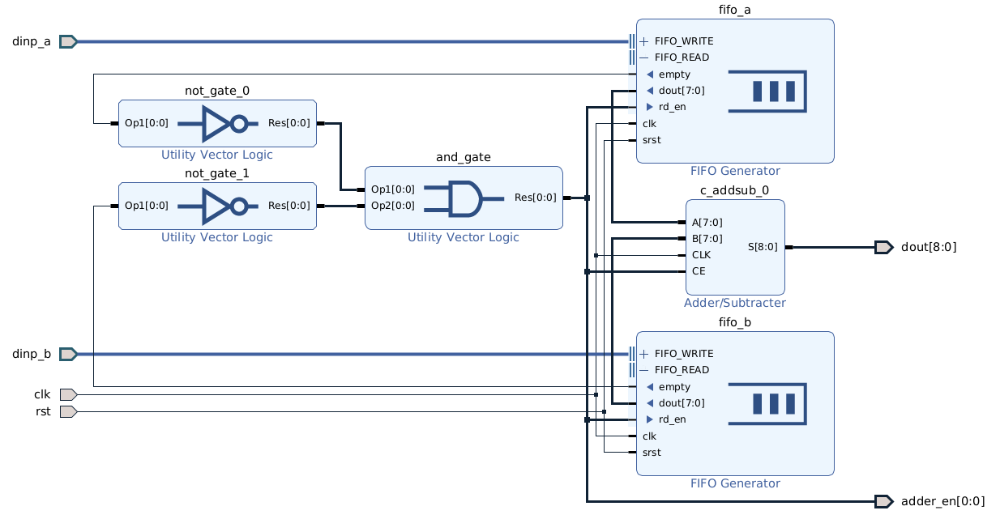

# Advanced Topics

## Пользовательский билдер

Иногда возникает необходимость добавить сборку цели по зависимости, для которых нет готового билдера. Например, в проекте требуется генерировать вспомогательный файл, создаваемый из некоторых параметров. Для этого **SCons** предоставляет те же средства, что и используются при описании инструментов сборки (Tools). 

Следующий пример демонстрирует технологию создания пользовательского билдера (и псевдобилдера) для генерирования текстового файла, описывающего некую Capability Structure (файл передаётся компилятору в процессе сборки основных целей). Зависимостями служат конфигурационные файлы, параметры которых определяют значения структуры. 

Весь процесс состоит из описания:

* исполнительной функция (action);
* функции-псевдобилдера;
* функции-инициализатора, создающей билдер и псевдобилдер.

#### Исполнительная функция, которая выполняет требуемые технические действия

```python
#-------------------------------------------------------------------------------
#
#   Capability structure create utility
#

from utils import *

#-------------------------------------------------------------------------------
#      
#   Action
#
def capstruct(target, source, env):
  
    cfg0 = import_config(str(source[0]), env['CFG_PATH'])
    cfg1 = import_config(str(source[1]), env['CFG_PATH'])
    
    trg = target[0]
    
    print('create auxiliary file:     \'' + trg.name + '\'')

    ...  # processing configuration parameters from cfg0 and cfg1        

#-----------------------------------------------------------
#      
#   Create output file
#         
    text  = ...  # create contents of the output file
    
    with open(str(trg), 'w') as out:
        out.write(text)
#-------------------------------------------------------------------------------
```

#### Функция-псевдобилдер, предоставляющая удобный интерфейс

```python
#-------------------------------------------------------------------------------
def create_capstruct(env, trg, src):
    
    source = []
    for s in src:
        source.append( search_file(s, env['CFG_PATH']) )
        
    return env.CapStruct(trg, source)    
        
#-------------------------------------------------------------------------------
```

#### Функция-инициализатор

Здесь создаётся объект-билдер, который далее добавляется к списку билдеров текущего сборочного окружения. Затем в СО добавляется функция-псевдобилдер.

```python
#-------------------------------------------------------------------------------
def init(env):
    CapStruct = Builder(action = capstruct)

    env.Append(BUILDERS = {'CapStruct' : CapStruct})

    env.AddMethod(create_capstruct, 'CreateCapStruct')

#-------------------------------------------------------------------------------
```

#### Применение в скрипте сценариев сборки

Весь код помещается в один файл — например, `capstruct.py`, после чего использование в скрипте сборочных сценариев выглядит так:

```python
import os
import capstruct

...

Import('envx')

envx.Tool('vivado')
envx.Tool('questa')

...

capstruct.init(envx)

...

CapStruct = envx.CreateCapStruct(os.path.join(envx['BUILD_SRC_PATH'], 'capstruct.txt'), ['cfg0.yml', 'cfg1.yml'])
...
envx.Alias('capstruct',  CapStruct)
...
```
***

## Подключение Vivado ILA

Настоящий пример демонстрирует способ подключения сигналов для аппаратной отладки с использованием Intergated Logic Analyzer (**ILA**) из состава САПР FPGA **Vivado** без привлечения возможностей GUI, т.е. только с помощью редактирования текстовых файлов (исходных и скриптов).

#### Общие сведения

Суть метода сводится к следующему:

1. В соответствующих исходных файлах выбираются сигналы, с которыми требуется работать с помощью **ILA**.
1. Для этих сигналов создаются локальные "дубликаты" — сигналы такого же типа, которым затем присваиваются значения интересуемых сигналов. "Дубликаты" объявляются с директивами `(* mark_debug = "true" *)` (чтобы синтезатор не удалил и не изменил эти сигналы при оптимизации). Далее сигналы-"дубликаты" и будут подключаться к пробникам логического анализатора. Такой приём используется для того, чтобы не "ломать" структуру рабочего кода и иметь возможность быстро включить или выключить отладку, не изменяя исходные файлы.
1. В специальный **Tcl** скрипт добавляются команды подключения назначенных для **ILA** сигналов, а скрипт добавляется к проекту и запускается на исполнение в начале этапа имплементации.

#### Реализация

В рассматриваемом примере используется исходный файл [`top.sv`](https://github.com/fpga-lib/vivado-boilerplate/blob/master/src/syn/top.sv) из состава [демонстрационного проекта-заготовки](https://github.com/fpga-lib/vivado-boilerplate/tree/master). Сигналами, предназначенными для наблюдения, выбраны:

```verilog
logic [`WIDTH-1:0] out;
logic              pll_locked;
```

Для них делается описание "дубликатов":

```verilog
//------------------------------------------------------------------------------
//
//    ILA debug
//
`ifdef TOP_DEBUG_ENABLE

(* mark_debug = "true" *) logic [`WIDTH-1:0] dbg_out;
(* mark_debug = "true" *) logic              dbg_pll_locked;

assign dbg_out        = out;
assign dbg_pll_locked = pll_locked;

`endif // TOP_DEBUG_ENABLE
```

Следует отметить, что вся секция с "дубликатами" помещена под директивы условной компиляции. Это сделано для того, чтобы можно было простым отключением макроса `TOP_DEBUG_ENABLE` подключить этот фрагмент кода к проекту или отключить.

Далее добавляется **Tcl** скрипт следующего содержания:

```tcl
    #--------------------------------------------------------
    #
    #   <build variant dir>/tcl/ila.tcl
    #
    1.  puts "\n------->>> Add net to debug probes <<<-------"
    2. 
    3.  create_debug_core ila_core ila
    4.  set_property ALL_PROBE_SAME_MU true [get_debug_cores ila_core]
    5.  set_property ALL_PROBE_SAME_MU_CNT 1 [get_debug_cores ila_core]
    6.  set_property C_ADV_TRIGGER false [get_debug_cores ila_core]
    7.  set_property C_DATA_DEPTH 1024 [get_debug_cores ila_core]
    8.  set_property C_EN_STRG_QUAL false [get_debug_cores ila_core]
    9.  set_property C_INPUT_PIPE_STAGES 0 [get_debug_cores ila_core]
    10. set_property C_TRIGIN_EN false [get_debug_cores ila_core]
    11. set_property C_TRIGOUT_EN false [get_debug_cores ila_core]
    12. set_property port_width 1 [get_debug_ports ila_core/clk]
    13. 
    14. connect_debug_port ila_core/clk [get_nets -hier -filter {NAME =~ *pll_inst/inst/clk_out1}]
    15. 
    16. #-------------------------------------------------------------------------------
    17. #
    18. #    Top module
    19. #
    20. if { $TOP_DEBUG_ENABLE } {
    21.     net2probe ila_core [get_nets -hier -filter {NAME =~ dbg_out[*]}]
    22.     net2probe ila_core [get_nets -hier -filter {NAME =~ dbg_pll_locked}]
    23. }
    24. puts "-----------------------------------------------\n"
```

Здесь производится настройка отладочного ядра под названием `ila_core` (имя можно выбрать произвольным). Чаще всего строки 3..12 менять не приходится, т.к. эти настройки пригодны для большинства проектов. Иногда нужно изменить длину захвата данных — здесь она равна 1024 (строка 7), это минимальное значение. Как правило нужно один раз настроить значение тактовой частоты отладочного ядра (строка 14), указав источник. 

И основная работа, которую нужно выполнять в процессе отладки, — это добавление/удаление сигналов для наблюдения, в данном примере это строки  20..23.


!!! info "ЗАМЕЧАНИЕ"

    В данном примере сигналы описаны как есть, без префиксов. Это потому, что подключаемые сигналы
    объявлены в модуле верхнего уровня. На практике основной случай, когда подключаемые сигналы
    объявлены в модулях по иерархии проекта. В этом случае синтаксис подключения несколько иной:

    ```tcl
    net2probe ila_core [get_nets -hier -filter {NAME =~ *<instance name>/<signal name>}]
    ```
    где `<instance name>` — имя экземпляра модуля, а `<signal name>` — имя сигнала.

----

В этом **Tcl** скрипте подключение сигналов производится по условию, которое задаёт одноимённая
переменная `TOP_DEBUG_ENABLE`&nbsp;– этим достигается синхронизация между HDL и **ILA** скриптом. Команда `net2probe`, используемая для подключения к сигналов к
отладочному ядру, описана в файле `ila_proc.tcl`, расположенном в директории служебных файлов
сборочной системы (по умолчанию `site_scons`). В этом же файле описана команда создания
дополнительного пробника `create_probe`. При создании отладочного ядра оно уже имеет один пробник
по умолчанию&nbsp;— к этому пробнику в вышеприведённом примере сигналы и подключаются. 

Необходимость создания дополнительных отладочных ядер возникает при аппаратной отладке сигналов из разных тактовых доменов. Т.к. отладочное ядро тактируется вполне конкретным тактовым сигналом, то подключать к этому ядру сигналы из других тактовых доменов некорректно. Поэтому для тех сигналов нужно создавать свои отладочные ядра, которые тактировать соответствующим образом. 

Несколько пробников может понадобиться в случае, когда нужны разные условия подключения сигналов. Сигналы, подключаемые к логическому анализатору, могут служить только для наблюдения или для наблюдения и синхронизации (запуска) захвата. Очевидно, что пробник с функцией захвата требует дополнительных ресурсов со стороны FPGA для организации логики запуска — нужны регистры, хранящие условия запуска, компараторы и т.д. В то же время обычно нет необходимости иметь возможность запуска захвата для всех сигналов. Поэтому логично создать как минимум два пробника, один с типом `DATA`, а другой с типом `DATA_AND_TRIGGER`. Этот параметр указывается при создании пробника командой `create_probe`.

Для управления всем вышеописанным удобно создать файл с параметрами:

```yaml
#-----------------------------------
#
#  ila.yml
#
parameters:
    USE_ILA            : 1
    TOP_DEBUG_ENABLE   : = 1 if USE_ILA else '__NO_DEFINE__'
```

который сделать зависимостью для генерируемых файлов `cfg_params.svh` и `ila_params.tcl`[^1]:

[^1]: Фрагменты из [файла скрипта сборочных сценариев из демонстрационного проекта](https://github.com/fpga-lib/vivado-boilerplate/blob/master/src/cfg/ac701/ac701.scons)

```python
...
hdl_param_deps = 'main.yml clk.yml ila.yml'
...
prj_impl_deps  = os.path.join(dirs.CFG, 'tcl', 'ila.tcl')
...
CfgParamsHeader    = envx.CreateCfgParamsHeader(os.path.join(envx['BUILD_SRC_PATH'], 'cfg_params.svh'), hdl_param_deps)
IlaParamsTcl       = envx.CreateCfgParamsTcl(os.path.join(envx['BUILD_SRC_PATH'], 'ila_params.tcl'), 'ila.yml')
...
Depends(ImplVivadoProject,  [prj_impl_deps])
```

Теперь при запуске проекта на сборку будет выполнено следующее:

```
create cfg params tcl:     'ila_params.tcl'
create cfg params header:  'cfg_params.svh'
create Vivado project:     'ac701'
...
***********************************
Vivado project successfully created
***********************************
...
synthesize Vivado project: 'ac701'
...
************************************************
Vivado project successfully synthesized
************************************************
...
implement Vivado project:  'ac701'
...
------->>> Add net to debug probes <<<-------
Connecting   4 nets: dbg_out[0] ... dbg_out[3]
Connecting   1 net : dbg_pll_locked
-----------------------------------------------
...
************************************************
Vivado project successfully implemented
************************************************
```

Как видно, на этапе имплементации (P&R) произведено успешное добавление сигналов к отладочному ядру. После загрузки битстрима в FPGA можно осуществлять наблюдение значений этих сигналов или устанавливать для них условия запуска захвата.

----

!!! info "ЗАМЕЧАНИЕ"

    Необходимо контролировать подключение сигналов&nbsp;— в случае неуспеха **Vivado** выдаёт
    предупреждение. Обычно это случается, если программе не удаётся найти указанный для подключения
    сигнал или его описание не соответствует ему&nbsp;— например, если сигнал является многобитным,
    а описан без маски `[*]` или наоборот&nbsp;— однобитный сигнал описан с такой маской.

----

## <a name="bd-create-example"></a> Создание блочного дизайна из Tcl скрипта

### Методика

Инструментарий САПР **Vivado** позволяет экспортировать блочный дизайн (БД) в виде **Tcl** скрипта и впоследствии воссоздать из этого скрипта блочный дизайн путём запуска в консоли **Vivado**. На этом обстоятельстве построена методика создания конфигурационного **Tcl** скрипта, используемого в системе сборки.

Методика создания блочного дизайна состоит из следующих шагов.

1. Средствами IP Integrator создаётся (отрисовывается) блочный дизайн в графическом виде.
1. Через меню `File->Export->Export Block Design...` дизайн экспортируется в **Tcl** скрипт.
1. Получившийся **Tcl** файл содержит много избыточной информации, интерес представляет фрагмент в конце между строками комментариев:

```
# Create interface ports
...
...
...
# Restore current instance
```

Этот фрагмент необходимо скопировать в отдельный файл, который и будет представлять собой
конфигурацию блочного дизайна. Именно этот фрагмент содержит описание всех cells, межсоединений и
портов блочного дизайна. Для полноценного скрипта, способного воссоздать блочный дизайн, недостаёт
только нескольких команд перед (пролог) и после (эпилог). Билдер блочных дизайнов системы сборки
автоматически генерирует прологи и эпилоги для всех БД проекта.

### Пример

В качестве примера создаётся БД сумматора с буферами FIFO и синхронизацией ввода:



После "отрисовки" БД в IP Integrator'е и экспорте БД в **Tcl** файл, интересующий фрагмент представляет собой следующее:

```tcl
  # Create interface ports
  set dinp_a [ create_bd_intf_port -mode Slave -vlnv xilinx.com:interface:fifo_write_rtl:1.0 dinp_a ]

  set dinp_b [ create_bd_intf_port -mode Slave -vlnv xilinx.com:interface:fifo_write_rtl:1.0 dinp_b ]


  # Create ports
  set adder_en [ create_bd_port -dir O -from 0 -to 0 adder_en ]
  set clk [ create_bd_port -dir I -type clk -freq_hz 125000000 clk ]
  set dout [ create_bd_port -dir O -from 8 -to 0 -type data dout ]
  set rst [ create_bd_port -dir I rst ]

  # Create instance: and_gate, and set properties
  set and_gate [ create_bd_cell -type ip -vlnv xilinx.com:ip:util_vector_logic:2.0 and_gate ]
  set_property -dict [ list \
   CONFIG.C_SIZE {1} \
 ] $and_gate

  # Create instance: c_addsub_0, and set properties
  set c_addsub_0 [ create_bd_cell -type ip -vlnv xilinx.com:ip:c_addsub:12.0 c_addsub_0 ]
  set_property -dict [ list \
   CONFIG.A_Type {Unsigned} \
   CONFIG.A_Width {8} \
   CONFIG.B_Type {Unsigned} \
   CONFIG.B_Width {8} \
   CONFIG.Latency {1} \
   CONFIG.Out_Width {9} \
 ] $c_addsub_0

  # Create instance: fifo_a, and set properties
  set fifo_a [ create_bd_cell -type ip -vlnv xilinx.com:ip:fifo_generator:13.2 fifo_a ]
  set_property -dict [ list \
   CONFIG.Data_Count_Width {5} \
   CONFIG.Fifo_Implementation {Common_Clock_Distributed_RAM} \
   CONFIG.Full_Threshold_Assert_Value {30} \
   CONFIG.Full_Threshold_Negate_Value {29} \
   CONFIG.Input_Data_Width {8} \
   CONFIG.Input_Depth {32} \
   CONFIG.Output_Data_Width {8} \
   CONFIG.Output_Depth {32} \
   CONFIG.Read_Data_Count_Width {5} \
   CONFIG.Write_Data_Count_Width {5} \
 ] $fifo_a

  # Create instance: fifo_b, and set properties
  set fifo_b [ create_bd_cell -type ip -vlnv xilinx.com:ip:fifo_generator:13.2 fifo_b ]
  set_property -dict [ list \
   CONFIG.Data_Count_Width {5} \
   CONFIG.Fifo_Implementation {Common_Clock_Distributed_RAM} \
   CONFIG.Full_Threshold_Assert_Value {30} \
   CONFIG.Full_Threshold_Negate_Value {29} \
   CONFIG.Input_Data_Width {8} \
   CONFIG.Input_Depth {32} \
   CONFIG.Output_Data_Width {8} \
   CONFIG.Output_Depth {32} \
   CONFIG.Read_Data_Count_Width {5} \
   CONFIG.Write_Data_Count_Width {5} \
 ] $fifo_b

  # Create instance: not_gate_0, and set properties
  set not_gate_0 [ create_bd_cell -type ip -vlnv xilinx.com:ip:util_vector_logic:2.0 not_gate_0 ]
  set_property -dict [ list \
   CONFIG.C_OPERATION {not} \
   CONFIG.C_SIZE {1} \
   CONFIG.LOGO_FILE {data/sym_notgate.png} \
 ] $not_gate_0

  # Create instance: not_gate_1, and set properties
  set not_gate_1 [ create_bd_cell -type ip -vlnv xilinx.com:ip:util_vector_logic:2.0 not_gate_1 ]
  set_property -dict [ list \
   CONFIG.C_OPERATION {not} \
   CONFIG.C_SIZE {1} \
   CONFIG.LOGO_FILE {data/sym_notgate.png} \
 ] $not_gate_1

  # Create interface connections
  connect_bd_intf_net -intf_net FIFO_WRITE_1 [get_bd_intf_ports dinp_a] [get_bd_intf_pins fifo_a/FIFO_WRITE]
  connect_bd_intf_net -intf_net FIFO_WRITE_1_1 [get_bd_intf_ports dinp_b] [get_bd_intf_pins fifo_b/FIFO_WRITE]

  # Create port connections
  connect_bd_net -net CLK_1 [get_bd_ports clk] [get_bd_pins c_addsub_0/CLK] [get_bd_pins fifo_a/clk] [get_bd_pins fifo_b/clk]
  connect_bd_net -net and_gate_Res [get_bd_ports adder_en] [get_bd_pins and_gate/Res] [get_bd_pins c_addsub_0/CE] [get_bd_pins fifo_a/rd_en] [get_bd_pins fifo_b/rd_en]
  connect_bd_net -net c_addsub_0_S [get_bd_ports dout] [get_bd_pins c_addsub_0/S]
  connect_bd_net -net fifo_generator_0_dout [get_bd_pins c_addsub_0/A] [get_bd_pins fifo_a/dout]
  connect_bd_net -net fifo_generator_0_empty [get_bd_pins fifo_a/empty] [get_bd_pins not_gate_0/Op1]
  connect_bd_net -net fifo_generator_1_dout [get_bd_pins c_addsub_0/B] [get_bd_pins fifo_b/dout]
  connect_bd_net -net fifo_generator_1_empty [get_bd_pins fifo_b/empty] [get_bd_pins not_gate_1/Op1]
  connect_bd_net -net not_gate_0_Res [get_bd_pins and_gate/Op1] [get_bd_pins not_gate_0/Res]
  connect_bd_net -net not_gate_1_Res [get_bd_pins and_gate/Op2] [get_bd_pins not_gate_1/Res]
  connect_bd_net -net rst_1 [get_bd_ports rst] [get_bd_pins fifo_a/srst] [get_bd_pins fifo_b/srst]
```

Использовать это описание в таком виде возможно, но как правило требуется некая параметризация БД, чтобы он был согласован с другими частями проекта и не приходилось при изменении того или иного параметра править этот конфигурационный **Tcl** файл. В частности, в данном случае имеет смысл параметризовать ширину шин данных, глубину буферов FIFO, рабочую частоту и т.п. Результирующий файл выглядит так:

```tcl
source $BUILD_SRC_DIR/cfg_params.tcl

#-------------------------------------------------------------------------------
#
#   BD Configuration Section
#

# Create interface ports
set dinp_a [ create_bd_intf_port -mode Slave -vlnv xilinx.com:interface:fifo_write_rtl:1.0 dinp_a ]
set dinp_b [ create_bd_intf_port -mode Slave -vlnv xilinx.com:interface:fifo_write_rtl:1.0 dinp_b ]

# Create ports
set clk [ create_bd_port -dir I -type clk -freq_hz [expr $MAIN_CLK*1000000] clk ]
set dout [ create_bd_port -dir O -from 47 -to 0 -type data dout ]
set rst [ create_bd_port -dir I rst ]

# Create instance: fifo_a, and set properties
set fifo_a [ create_bd_cell -type ip -vlnv xilinx.com:ip:fifo_generator:13.2 fifo_a ]
set_property -dict [ list \
    CONFIG.Data_Count_Width ${FIFO_DCOUNT_WIDTH} \
    CONFIG.Fifo_Implementation {Common_Clock_Distributed_RAM} \
    CONFIG.Full_Threshold_Assert_Value [expr ${FIFO_DEPTH}-2] \
    CONFIG.Full_Threshold_Negate_Value [expr ${FIFO_DEPTH}-3] \
    CONFIG.Input_Data_Width ${DATA_WIDTH} \
    CONFIG.Input_Depth ${FIFO_DEPTH} \
    CONFIG.Output_Data_Width ${DATA_WIDTH} \
    CONFIG.Output_Depth ${FIFO_DEPTH} \
    CONFIG.Read_Data_Count_Width ${FIFO_DCOUNT_WIDTH} \
    CONFIG.Write_Data_Count_Width ${FIFO_DCOUNT_WIDTH} \
] $fifo_a

# Create instance: fifo_b, and set properties
set fifo_b [ create_bd_cell -type ip -vlnv xilinx.com:ip:fifo_generator:13.2 fifo_b ]
set_property -dict [ list \
    CONFIG.Data_Count_Width ${FIFO_DCOUNT_WIDTH} \
    CONFIG.Fifo_Implementation {Common_Clock_Distributed_RAM} \
    CONFIG.Full_Threshold_Assert_Value [expr ${FIFO_DEPTH}-2] \
    CONFIG.Full_Threshold_Negate_Value [expr ${FIFO_DEPTH}-3] \
    CONFIG.Input_Data_Width ${DATA_WIDTH} \
    CONFIG.Input_Depth ${FIFO_DEPTH} \
    CONFIG.Output_Data_Width ${DATA_WIDTH} \
    CONFIG.Output_Depth ${FIFO_DEPTH} \
    CONFIG.Read_Data_Count_Width ${FIFO_DCOUNT_WIDTH} \
    CONFIG.Write_Data_Count_Width ${FIFO_DCOUNT_WIDTH} \
] $fifo_b

# Create instance: c_addsub_0, and set properties
set c_addsub_0 [ create_bd_cell -type ip -vlnv xilinx.com:ip:c_addsub:12.0 c_addsub_0 ]

set_property -dict [ list                     \
    CONFIG.A_Type {Unsigned}                  \
    CONFIG.A_Width ${DATA_WIDTH}              \
    CONFIG.B_Type {Unsigned}                  \
    CONFIG.B_Width ${DATA_WIDTH}              \
    CONFIG.Latency {1}                        \
    CONFIG.Out_Width [expr ${DATA_WIDTH} + 1] \
] $c_addsub_0

# Create instance: not_gate_0, and set properties
set not_gate_0 [ create_bd_cell -type ip -vlnv xilinx.com:ip:util_vector_logic:2.0 not_gate_0 ]
set_property -dict [ list \
    CONFIG.C_OPERATION {not} \
    CONFIG.C_SIZE {1} \
    CONFIG.LOGO_FILE {data/sym_notgate.png} \
] $not_gate_0

# Create instance: and_gate, and set properties
set and_gate [ create_bd_cell -type ip -vlnv xilinx.com:ip:util_vector_logic:2.0 and_gate ]
set_property -dict [ list \
    CONFIG.C_SIZE {1} \
] $and_gate

# Create instance: not_gate_1, and set properties
set not_gate_1 [ create_bd_cell -type ip -vlnv xilinx.com:ip:util_vector_logic:2.0 not_gate_1 ]
set_property -dict [ list \
    CONFIG.C_OPERATION {not} \
    CONFIG.C_SIZE {1} \
    CONFIG.LOGO_FILE {data/sym_notgate.png} \
] $not_gate_1

create_bd_port -dir O adder_en

# Create interface connections
connect_bd_intf_net -intf_net FIFO_WRITE_1 [get_bd_intf_ports dinp_a] [get_bd_intf_pins fifo_a/FIFO_WRITE]
connect_bd_intf_net -intf_net FIFO_WRITE_1_1 [get_bd_intf_ports dinp_b] [get_bd_intf_pins fifo_b/FIFO_WRITE]

# Create port connections
connect_bd_net -net CLK_1 [get_bd_ports clk] [get_bd_pins c_addsub_0/CLK] [get_bd_pins fifo_a/clk] [get_bd_pins fifo_b/clk]

connect_bd_net -net fifo_generator_0_empty [get_bd_pins fifo_a/empty] [get_bd_pins not_gate_0/Op1]
connect_bd_net -net fifo_generator_1_empty [get_bd_pins fifo_b/empty] [get_bd_pins not_gate_1/Op1]

connect_bd_net -net not_gate_0_Res [get_bd_pins not_gate_0/Res] [get_bd_pins and_gate/Op1]
connect_bd_net -net not_gate_1_Res [get_bd_pins not_gate_1/Res] [get_bd_pins and_gate/Op2]
connect_bd_net -net c_addsub_0_S [get_bd_ports dout] [get_bd_pins c_addsub_0/S]

connect_bd_net -net and_gate_Res [get_bd_pins and_gate/Res] [get_bd_pins c_addsub_0/CE] [get_bd_pins fifo_a/rd_en] [get_bd_pins fifo_b/rd_en] [get_bd_ports adder_en]

connect_bd_net -net fifo_generator_0_dout [get_bd_pins c_addsub_0/A] [get_bd_pins fifo_a/dout]
connect_bd_net -net fifo_generator_1_dout [get_bd_pins c_addsub_0/B] [get_bd_pins fifo_b/dout]
connect_bd_net [get_bd_ports rst] [get_bd_pins fifo_b/srst]
connect_bd_net [get_bd_ports rst] [get_bd_pins fifo_a/srst]

#-------------------------------------------------------------------------------
```

Следует обратить внимание на то, что первой строкой идёт загрузка конфигурационного **Tcl** файла с параметрами, на которые далее ссылаются выражения, чтобы достичь целей параметризации. Сам этот загружаемый конфигурационный файл является генерируемым системой сборки из пользовательских _yml_ конфигурационных файлов. Содержимое `cfg_params.tcl`:

```tcl
#--------------------------------------------------------------------------------
#
#   This file is automatically generated. Do not edit the file!
#
#--------------------------------------------------------------------------------

set VERBOSE              1
set BASE_CLK             125
set VARIANT_NAME         ac701
set PROJECT_NAME         ac701
set TOP_NAME             top
set TESTBENCH_NAME       top_tb
set DEVICE               xc7a200tfbg676-2
set COMPLEX_EXAMPLE      ""
set DATA_WIDTH           8
set FIFO_DEPTH           32
set FIFO_DCOUNT_WIDTH    5
set CLK_OUT_PHASE_SHIFT  270
set REF_CLK              200
set MAIN_CLK             125
set DIFF_REFCLK          yes
set REF_CLK_PERIOD       5.0
set REF_CLK_HALF_PERIOD  2.5
#--------------------------------------------------------------------------------
```

В дальнейшем система сборки генерирует целевой файл создания БД, который выглядит так:

```tcl
#--------------------------------------------------------------------------------
#
#   Block design "adder" create script
#...
#   This file is automatically generated. Do not edit the file manually.
#
#--------------------------------------------------------------------------------

set PROJECT_NAME   adder
set TOP_NAME       adder
set DEVICE         xc7a200tfbg676-2
set BUILD_SRC_DIR  /opt/slon/xilinx/build-system-examples/build/ac701/src
set SIM_SCRIPT_DIR /opt/slon/xilinx/build-system-examples/build/ac701/syn/sim_script

create_project -f ${PROJECT_NAME}.xpr ..
set_property part  ${DEVICE} [current_project]
set_property top ${TOP_NAME} [get_filesets sources_1]

set bd_name    {adder}
set bd_path    {/opt/slon/xilinx/build-system-examples/build/ac701/bd/adder/adder.srcs/sources_1/bd/adder/adder.bd}
set bd_wrapper ${PROJECT_NAME}.gen/sources_1/bd/${bd_name}/hdl/${bd_name}_wrapper.v

puts ""
puts "======== Create block design \"$bd_name\" ========"..
create_bd_design "${bd_name}"
open_bd_design ${bd_path}

source {/opt/slon/xilinx/build-system-examples/src/cfg/ac701/bd/adder.tcl}

validate_bd_design
make_wrapper -files [get_files ${bd_path}] -top
add_files -norecurse ${bd_wrapper}
update_compile_order -fileset sources_1

puts ""
puts "-------- Export simulation for \"$bd_name\" --------"
set_property top ${bd_name}_wrapper [get_filesets sim_1]
generate_target simulation [get_files ${bd_path}] -force
export_simulation -of_objects [get_files ${bd_wrapper}] -simulator questa -absolute_path -force -directory ${SIM_SCRIPT_DIR}/${bd_name}
.
#--------------------------------------------------------------------------------
```

Этот файл помещается в `build/<build-variant-name>/bd/_script`. Путём запуска этого скрипта с помощью САПР **Vivado** осуществляется создание проекта **Vivado**, содержащего данный БД. В дальнейшем, как уже было сказано, на этапе создания основного проекта **Vivado** для текущего сборочного варианта, система сборки подключает созданные таким образом БД в проект.